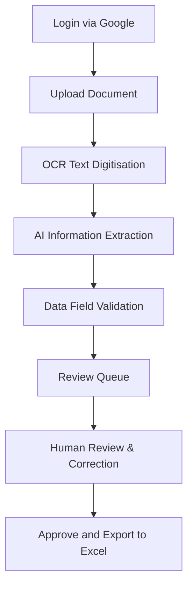

# Intelligent Document Processing (IDP) Platform

The Intelligent Document Processing (IDP) Platform is a professional solution designed to automate the ingestion, classification, and extraction of key data from financial documents using artificial intelligence. The platform processes documents locally, converting unstructured paper and digital documents into structured, verified datasets, significantly reducing manual administrative effort

The platform is capable of processing a wide variety of financial and business documents, including:
- Invoices
- Receipts
- Quotations
- Purchase Orders
- Delivery Notes
- Financial Documents

---

## Features

The platform provides a comprehensive suite of features to ensure accurate, secure, and efficient document processing:

*   **Secure Google Login:** Restricts access using enterprise-grade Google OAuth authentication.
*   **Single and Batch Upload:** Supports processing either a single file or multiple documents simultaneously.
*   **AI-Powered OCR:** Converts scanned files and PDFs into digital, searchable text format.
*   **Automatic Document Classification:** Detects and classifies the incoming document type.
*   **Intelligent Information Extraction:** Uses local artificial intelligence to extract data points contextually.
*   **Entity Extraction:** Automatically extracts vendor and customer details.
*   **Financial Data Parsing:** Accurately extracts values such as subtotals, VAT, totals, and currencies.
*   **Review Queue:** Provides a side-by-side interface to inspect original documents against extracted data.
*   **Confidence Scoring:** Generates confidence metrics for extracted values.
*   **Manual Correction:** Allows operators to edit and override extracted fields.
*   **Excel Export:** Exports processed data into structured Excel spreadsheets.
*   **Batch Processing:** Efficiently handles queues of uploaded files.
*   **Dashboard:** Provides an analytics overview of document processing volume, statuses, and performance.

---

## Technology Stack

| Layer | Technology | Purpose |
| :--- | :--- | :--- |
| **Backend** | Python, FastAPI, SQLite | Core application server, API routing, and lightweight, secure database storage. |
| **AI Engine** | Qari OCR, Ollama, Gemma 4 | Text digitisation and local large language model inference. |
| **Frontend** | HTML, CSS, JavaScript, Jinja2 | Responsive, clean user interface with dynamic server-side template rendering. |
| **Authentication** | Google OAuth | Secure authentication middleware. |

---

## Project Structure

The production codebase is organized as follows:

```text
├── backend/          # Application initialization and core configuration
├── database/         # Database models, connection management, and CRUD utilities
├── routers/          # API endpoints and page view controllers
├── services/         # Business logic, OCR integration, and AI extraction workflows
├── static/           # Static frontend files (CSS styles, JavaScript, and graphics)
├── templates/        # HTML layout files rendered using Jinja2
├── uploads/          # Local storage for uploaded document files
└── exports/          # Local storage for generated Excel spreadsheets
```

---

## Installation

Follow these steps to set up the application environment:

1. **Clone the Repository**
   ```bash
   git clone <repository-url>
   cd idp
   ```

2. **Create a Virtual Environment**
   ```bash
   python -m venv venv
   ```

3. **Activate the Virtual Environment**
   *   **On Windows:**
       ```cmd
       venv\Scripts\activate
       ```
   *   **On macOS/Linux:**
       ```bash
       source venv/bin/activate
       ```

4. **Install Dependencies**
   ```bash
   pip install -r requirements.txt
   ```

---

## Environment Variables

Configure a `.env` file in the root directory. Below are the required configuration keys:

```env
SECRET_KEY=your_secret_key_here
GOOGLE_CLIENT_ID=your_google_client_id_here
GOOGLE_CLIENT_SECRET=your_google_client_secret_here
GOOGLE_REDIRECT_URI=your_google_redirect_uri_here
EXTRACTION_ENGINE=your_extraction_engine
OLLAMA_MODEL=gemma4:e4b
```
*Note: Ensure actual credential values are kept confidential and not committed to public version control.*

---

## Install Ollama

The platform requires Ollama to handle the Generative AI inference locally.

1. **Download Ollama**
   Download and install Ollama for your operating system from the official website.

2. **Pull the Gemma Model**
   Pull the model specified in the environment configuration:
   ```bash
   ollama pull gemma4:e4b
   ```

3. **Verify the Model**
   Ensure the model is loaded and available:
   ```bash
   ollama list
   ```

---

## Running the Application

To start the local web server:

```bash
python app.py
```
or
```bash
uvicorn backend.main:app --reload
```

Once running, open your web browser and navigate to:
[http://localhost:8000](http://localhost:8000)

---

## Workflow

The document processing life cycle is outlined below:



---

## Excel Export

Spreadsheets exported from the platform map key document attributes into structured rows. The following fields are included:

| Field Name | Description |
| :--- | :--- |
| **Vendor** | The merchant or supplier issuing the document |
| **Customer** | The purchaser or recipient entity |
| **Invoice Number** | Unique invoice identifier |
| **Invoice Date** | Issue date of the document |
| **Currency** | Monetary currency code |
| **Subtotal** | Net total before taxes |
| **VAT** | Value Added Tax or sales tax amount |
| **Total** | Gross total amount due |
| **Purchase Order** | Associated Purchase Order number (if available) |
| **Reference Number** | Document reference identifier |
| **Document Type** | Classified category of the document |

---

## Supported Documents

The platform is pre-configured to process:
*   **Invoices:** Direct commercial invoices including taxation breakdowns.
*   **Receipts:** Retail, food, travel, and utility receipts.
*   **Purchase Orders:** Generated procurement requests.
*   **Delivery Notes:** Documentation confirming item deliveries.
*   **Quotations:** Pricing estimates and service bids.
*   **Financial Documents:** Other standard billing and account records.

---

## Security

Security and confidentiality are critical pillars of the platform:

*   **Google OAuth:** Secure authentication restricts access to authorized corporate accounts.
*   **Read-Only Integrity:** Source documents are processed without modification, preserving the exact original file uploads.
*   **Local Processing:** All documents are stored on the local environment host.
*   **On-Premise AI Inference:** Generative AI models run locally via Ollama, ensuring data never leaves your secure local infrastructure.

---

## Notes

*   **Internet Access:** Required only for the initial Google Authentication sign-in flow.
*   **AI Engine Check:** The local Ollama service must be running, and the specified Gemma model must be fully downloaded before starting the server.
*   **Data Storage:** Uploaded files and generated export sheets remain strictly inside the local `uploads/` and `exports/` folders.

---

## Troubleshooting

| Issue | Potential Cause | Resolution |
| :--- | :--- | :--- |
| **Ollama not running** | Ollama service is stopped | Start the Ollama program on your system. |
| **Model not found** | Gemma model was not downloaded | Run `ollama pull gemma4:e4b` to install the required model files. |
| **Google OAuth issues** | Missing or incorrect client settings | Check client IDs and Redirect URIs in `.env`. Ensure your redirect URI matches your Google Cloud Console configuration exactly. |
| **Port already in use** | Another server is using port 8000 | Stop the conflicting process or change the port binding options. |
| **Missing environment variables** | `.env` configuration is incomplete | Ensure all variables specified in the Environment section are defined in your `.env` file. |

---

## License

**Private Software**

Developed exclusively for the client. All rights reserved.
